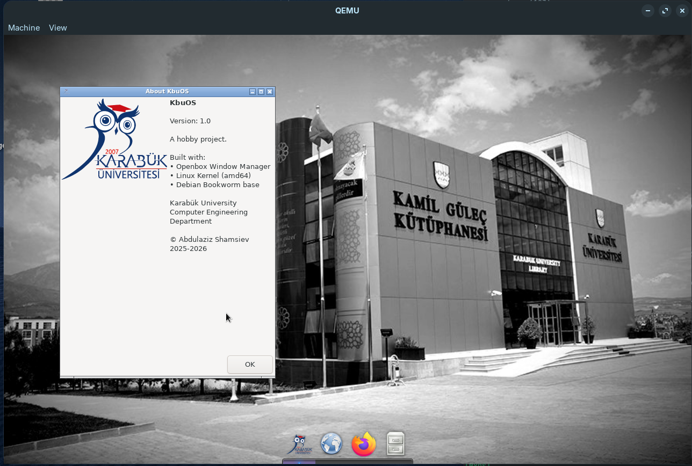
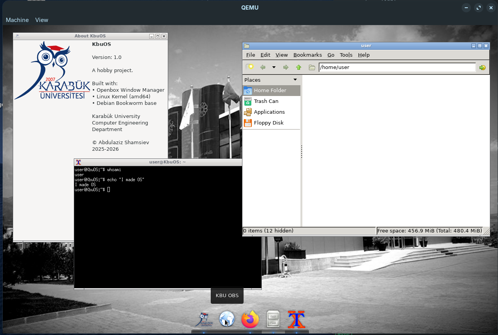
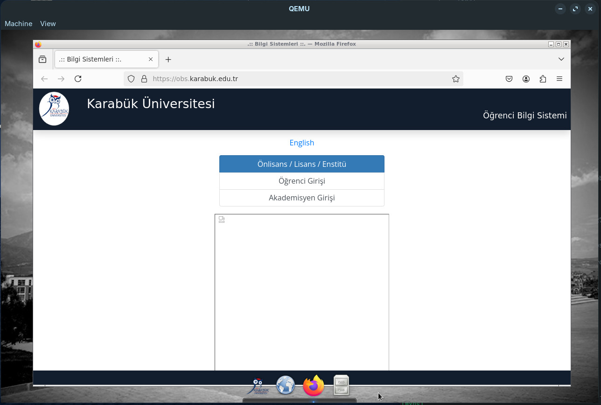

# KbuOS

<p align="center">
  
</p>

A minimal Linux distribution based on Debian, featuring Openbox window manager with a modern desktop experience.

## 📥 Download

| Version | Download | Size |
|---------|----------|------|
| KbuOS 1.0 | [KbuOS.iso](https://github.com/YOUR_USERNAME/kbuos/releases/latest/download/KbuOS.iso) | ~580 MB |

> **Note:** Replace the download link with your actual release URL after uploading.

## ✨ Features

- **Openbox** - Lightweight window manager
- **Plank** - macOS-style dock at the bottom
- **Picom** - Compositor for transparency and shadows
- **Firefox ESR** - Web browser
- **PCManFM** - File manager
- **LightDM** - Login manager with custom wallpaper
- **KBU OBS** - Quick access to student portal

## 🖼️ Screenshots





## 🔧 Building from Source

### Requirements

- **OS:** Debian 12, Ubuntu 22.04+ or Any Debian based distro
- **Disk:** ~5 GB free space
- **RAM:** 2 GB minimum
- **Privileges:** Root access required

### Build Instructions

```bash
# Clone the repository
git clone https://github.com/utmp/kbuos.git
cd kbuos

# Build the ISO
sudo ./build.sh
```

The build process takes approximately 10-20 minutes depending on your internet connection.

### Output

After successful build:
- `KbuOS.iso` - Bootable ISO image (~580 MB)

## 🚀 Testing

### QEMU (Recommended)

```bash
qemu-system-x86_64 -cdrom KbuOS.iso -m 2048 -enable-kvm
```

### VirtualBox or VMWare

1. Create new VM (Linux, Debian 64-bit)
2. Allocate 2 GB RAM
3. Mount `KbuOS.iso` as optical drive
4. Boot from optical

### USB Drive

```bash
sudo dd if=KbuOS.iso of=/dev/sdX bs=4M status=progress
```

> ⚠️ Replace `/dev/sdX` with your USB device. **All data will be erased!**

## 🔑 Default Credentials

| User | Password |
|------|----------|
| user | user |
| root | kbuos |


## 📜 License

This project is for educational purposes.

## 👤 Author

**Abdulaziz Shamsiev**  
Karabük University - Computer Engineering Department

---

<p align="center">
  <sub>Built with ❤️ at Karabük University</sub>
</p>
